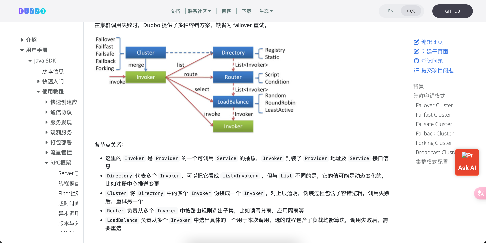

# DUbbo负载均衡策略
> 先阅读:[负载均衡策略与配置细节](./负载均衡策略与配置细节%20_%20Apache%20Dubbo.pdf) & [自适应负载均衡与限流 _ Apache Dubbo](./自适应负载均衡与限流%20_%20Apache%20Dubbo.pdf)


Dubbo 默认的负载均衡策略： Weighted Random LoadBalance（加权随机） ， 还要注意: 
1. ConsistentHash LoadBalance(一致性哈希) ， 确定的入参和确定的提供者，适用于有状态的请求(如 需要会话 )


## 负载均衡&限流配置
### 负载均衡配置
```conf
# 配置服务的客户端的 loadbalance 属性为 leastactive，此 Loadbalance 会调用并发数最小的 Provider（Consumer端并发数）。
<dubbo:reference interface="com.foo.BarService" loadbalance="leastactive" />

或 

<dubbo:service interface="com.foo.BarService" loadbalance="leastactive" />
```

### 限流配置
> 先阅读:[自适应负载均衡与限流 _ Apache Dubbo](./cn.dubbo.apache.org_zh-cn_overview_reference_proposals_heuristic-flow-control_.png)

##### 配置方式
```conf
   <dubbo:provider flowcontrol="heuristicSmoothingFlowControl" />
   
   # 服务粒度
   <dubbo:service interface="com.foo.BarService" flowcontrol="heuristicSmoothingFlowControl" />
```

---

## 负载均衡生效环节
