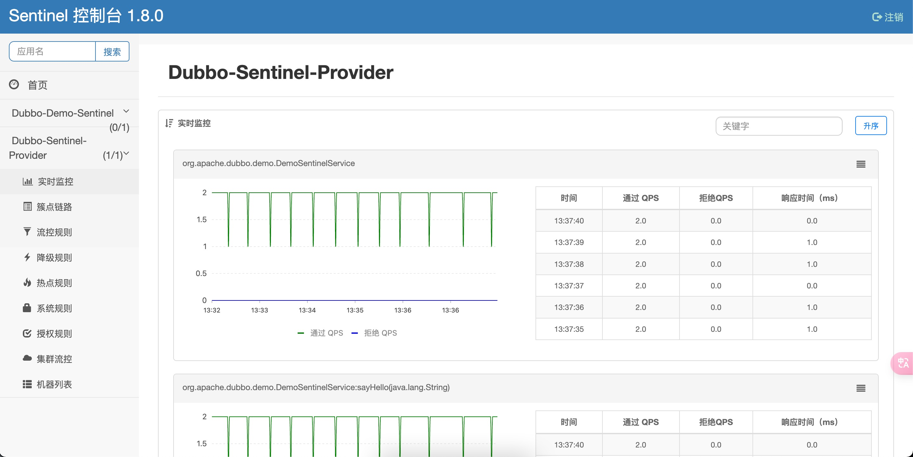

# Dubbo 限流降级
Dubbo服务降级是一种容错机制，用于在分布式系统中处理在异常或故障的情况下保障系统的可用性和稳定性。服务降级的核心思想是当调用远程服务失败或超时时，不会让整个业务流程崩溃，而是通过提供备用方案来保持部分功能的正常运行。

## 常见的服务降级场景和触发条件
- 远程调用失败
   + 当远程服务提供者不可用或调用失败，Dubbo可以根据容错策略自动切换到其他可用的提供者，从而保障业务的可用性
- 超时 
   + 若远程调用超过了设定的超时时间，Dubbo可以根据容错策略进行处理，可以选择重试、返回默认值或快速失败
- 资源限制
   + 当系统资源（线程池、连接池等）达到上限，Dubbo可以根据容错策略拒绝新请求，以保护系统免受过度压力
- 异常
   + 当远程调用异常，Dubbo就会根据容错策略来决定是否继续尝试调用该服务，或采取其他措施

## 限流降级方案
### 1. 使用 Sentinel 应对突发流量
> 工作机制: [Dubbo Filter](../../003.DUBBO-INTERNAL/000.DUBBO-Filter/000.从DUBBO启动分析Filter的解析与加载.md)

导入Sentinel依赖
```maven
    <dependency>
    	<groupId>com.alibaba.csp</groupId>
    	<artifactId>sentinel-apache-dubbo3-adapter</artifactId>
    	<version>1.8.6</version>
    </dependency>
    <!-- optional -->
    <dependency>
    	<groupId>com.alibaba.csp</groupId>
    	<artifactId>sentinel-transport-simple-http</artifactId>
    	<version>1.8.6</version>
    </dependency>
```
> 见代码:[Berries-Dubbo/001.SOURCE_CODE/000.DUBBO-3.3.2-RELEASE/000.DUBBO-3.3.2-RELEASE/dubbo-demo/dubbo-demo-sentinel](../../001.SOURCE_CODE/000.DUBBO-3.3.2-RELEASE/000.DUBBO-3.3.2-RELEASE/dubbo-demo/dubbo-demo-sentinel)

引入此依赖后，Dubbo 的服务接口和方法（包括调用端和服务端）就会成为 Sentinel 中的资源，在配置了规则后就可以自动享受到 Sentinel 的防护能力。
- sentinel-apache-dubbo3-adapter 中包含 Sentinel Filter 实现，加入依赖之后会自动开启。如若不希望开启 Sentinel Dubbo Adapter 中的某个 Filter，可通过配置关闭，如 dubbo.provider.filter="-sentinel.dubbo.consumer.filter"。
- Sentinel Dashboard: 


### 2. 框架内置的并发控制策略

### 3. 自适应限流